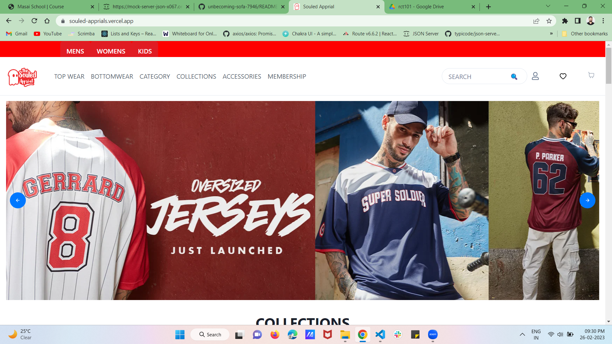
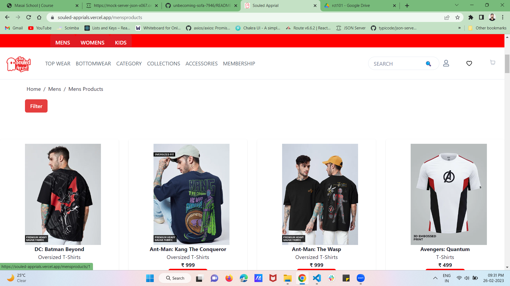
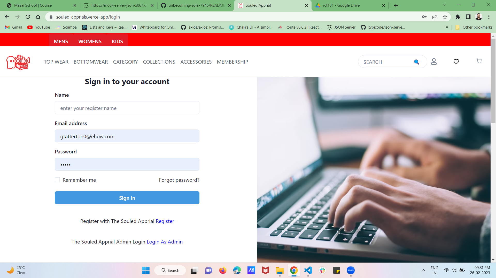
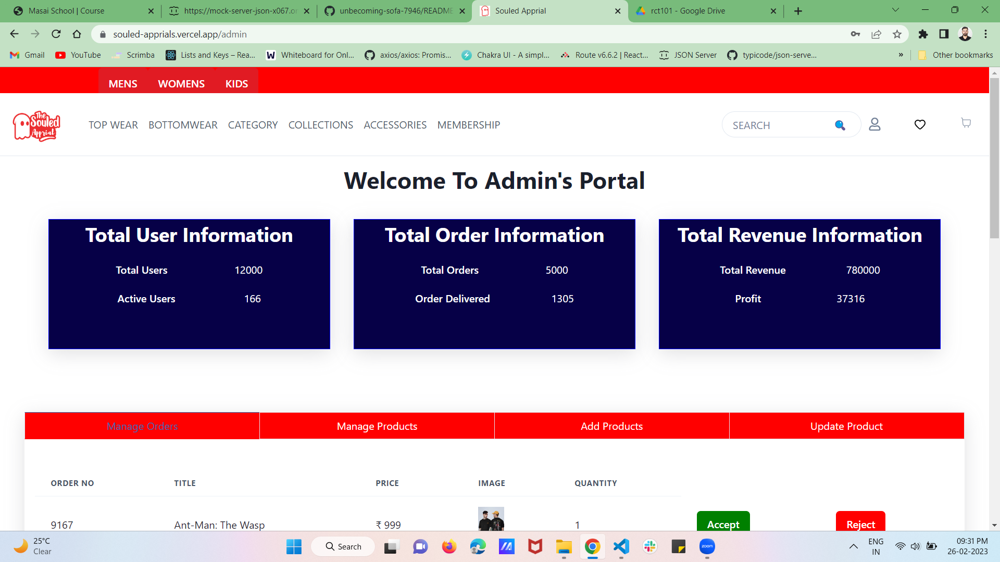

Project Code # lovely-thing-6254 
The Souled Store Clone 
-----
### For Educational And Learning Purpose*

Project: make a clone of The Souled Store website.

Original-Website: https://www.thesouledstore.com/men

Cloned-Website: https://souled-apprials.vercel.app/

Discover a world of unique and quirky merchandise at Souled Store. From licensed products to exclusive designs, we offer premium quality t-shirts, mobile covers, mugs, badges, notebooks, and more. Enjoy free shipping across India and dedicated customer service. Shop now and bring some fun to your life!
At Souled Store, we don't just sell merchandise; we provide a unique shopping experience that celebrates your love for all things cool and quirky. So, come on in and explore our collection. We guarantee you'll find something that will make you smile.

# Technology Stack Used :star2:
* React
* CSS
* JavaScript
* For API I Used Render To Delpoy My Backend Server
* Chakra UI

For storing user data ,I used Api with ASxios method

# Snapshots :camera:
* Landing page (Home page) 

![Landing page (Home page)] 

* Product page
![Product page]  

* Signin page

![Signin page]  

*Admin page

![Admin page] 

## How to run the Project

* Open the vercel link the attached abouve and use the app 
* I am using render service for the backend part so the added data will be removed after some because of render rules 

## End Notes :bookmark_tabs:
In this project I tried to achieve a near to perfect clone of the original website as much as possible. This entire journey of this construct week has given us experiences and  ihave learned lots of things by applying to the real website and it gave me a lot of confidence. Most of the features are added and functionality of the website is achieved.
## Limitations
As Render work slow in free service so some time data will display on the dom late, 
